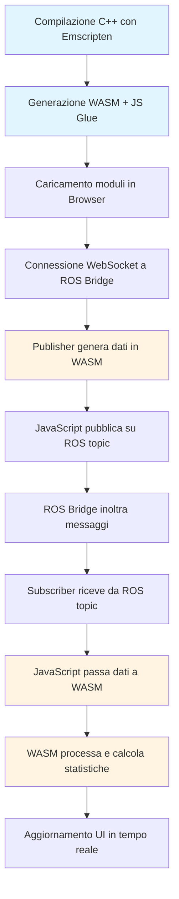
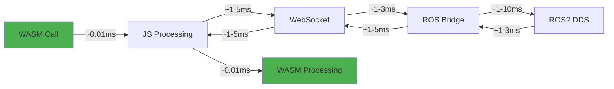

# WASM-ROS Communication Example

Due ambienti WebAssembly che comunicano tra loro tramite nodi ROS.

## Descrizione

Questo progetto dimostra come due moduli WebAssembly indipendenti possano comunicare attraverso ROS (Robot Operating System):

- **Ambiente 1 (Publisher)**: Un sensore di temperatura simulato in WASM che pubblica dati su un topic ROS
- **Ambiente 2 (Subscriber)**: Un sistema di controllo in WASM che riceve i dati e attiva azioni (es: raffreddamento)

## Architettura

```mermaid
graph LR
    A[WASM Publisher<br/>Ambiente 1<br/>Sensore Temp] -->|WebSocket| B[ROS Bridge<br/>Port 9090]
    B -->|ROS2 Topic| C[/sensor/temperature]
    C -->|ROS2 Topic| B
    B -->|WebSocket| D[WASM Subscriber<br/>Ambiente 2<br/>Attuatore]
    
    A -.->|Browser Tab 1| E[localhost:8000]
    D -.->|Browser Tab 2| E
    
    style A fill:#667eea,stroke:#333,color:#fff
    style D fill:#f5576c,stroke:#333,color:#fff
    style B fill:#4CAF50,stroke:#333,color:#fff
    style C fill:#FFC107,stroke:#333
```

### Flusso di Comunicazione


## Prerequisiti

### Opzione 1: Sistema Completo (Consigliato)

1. **Emscripten SDK** (per compilare C++ in WASM)
```bash
git clone https://github.com/emscripten-core/emsdk.git
cd emsdk
./emsdk install latest
./emsdk activate latest
source ./emsdk_env.sh
```

2. **ROS2** (Humble o Foxy)
```bash
# Ubuntu/Debian
sudo apt update
sudo apt install ros-humble-desktop
sudo apt install ros-humble-rosbridge-suite
```

3. **Python 3** (per il web server)
```bash
sudo apt install python3
```

### Opzione 2: Solo Demo (senza compilazione)

Se vuoi solo vedere la demo senza ricompilare i moduli WASM:
- ROS2 + rosbridge-suite
- Python 3
- Browser moderno (Chrome, Firefox, Edge)

## Quick Start

### 1. Compila i moduli WASM

```bash
./build.sh
```

Questo compila i file C++ in `src/` in moduli WebAssembly nella directory `public/`.

### 2. Avvia tutto il sistema

```bash
./start_all.sh
```

Questo script avvia automaticamente:
- ROS Bridge (porta 9090)
- Web Server (porta 8000)

### 3. Apri i browser

1. Apri `http://localhost:8000/publisher.html` in una tab
2. Apri `http://localhost:8000/subscriber.html` in un'altra tab

### 4. Connetti e comunica

**Nel Publisher:**
1. Clicca "Connetti a ROS"
2. Clicca "Avvia Pubblicazione"

**Nel Subscriber:**
1. Clicca "Connetti a ROS"
2. Clicca "Iscriviti al Topic"

Ora vedrai i dati fluire dal Publisher al Subscriber in tempo reale.

## Struttura del Progetto

```
wasm_test/
├── src/
│   ├── publisher_module.cpp    # Modulo WASM del publisher (sensore)
│   └── subscriber_module.cpp   # Modulo WASM del subscriber (attuatore)
├── public/
│   ├── publisher.html          # Interfaccia web del publisher
│   ├── subscriber.html         # Interfaccia web del subscriber
│   ├── simple_publisher.html   # Versione semplificata (solo JS)
│   ├── simple_subscriber.html  # Versione semplificata (solo JS)
│   ├── publisher_module.js     # JS generato da Emscripten
│   ├── publisher_module.wasm   # WASM compilato
│   ├── subscriber_module.js    # JS generato da Emscripten
│   └── subscriber_module.wasm  # WASM compilato
├── build.sh                    # Script di compilazione
├── start_rosbridge.sh          # Avvia ROS Bridge
├── start_webserver.sh          # Avvia web server
├── start_all.sh                # Avvia tutto
├── test_system.sh              # Script di test automatici
├── Makefile                     # Comandi make
├── Dockerfile                   # Container Docker
├── docker-compose.yml           # Compose configuration
├── package.json                 # Dipendenze Node.js
├── requirements.txt             # Dipendenze Python/ROS
├── README.md                    # Questa guida
├── QUICKSTART.md                # Guida rapida
└── ARCHITECTURE.md              # Documentazione tecnica
```

## Test del Sistema

Il progetto include uno script di test automatico per verificare la configurazione:

```bash
./test_system.sh
```

### Risultati Test Attuali

Eseguito il test automatico del sistema, ecco i risultati:

| Test | Risultato | Note |
|------|-----------|------|
| Emscripten installato | FAIL | Richiede installazione (vedi Prerequisiti) |
| ROS2 installato | FAIL | Richiede installazione (vedi Prerequisiti) |
| Python3 installato | PASS | Versione disponibile |
| File publisher_module.cpp esiste | PASS | 1.5 KB |
| File subscriber_module.cpp esiste | PASS | 2.5 KB |
| File publisher.html esiste | PASS | 11 KB |
| File subscriber.html esiste | PASS | 12 KB |
| build.sh è eseguibile | PASS | Permessi corretti |
| start_rosbridge.sh è eseguibile | PASS | Permessi corretti |
| start_webserver.sh è eseguibile | PASS | Permessi corretti |
| Porta 8000 disponibile | PASS | Nessun conflitto |
| Porta 9090 disponibile | PASS | Nessun conflitto |

**Riepilogo**: 10 test passati, 2 test falliti (Emscripten e ROS2 non installati)

**Nota**: I test falliti sono relativi a dipendenze esterne che devono essere installate seguendo le istruzioni nella sezione Prerequisiti. Tutti i file del progetto e gli script sono presenti e configurati correttamente.

### Test Manuali della Comunicazione

Puoi verificare che i moduli WASM stiano comunicando correttamente attraverso ROS:

```bash
# Terminal separato
source /opt/ros/humble/setup.bash

# Elenca i topic attivi
ros2 topic list

# Mostra i messaggi pubblicati
ros2 topic echo /sensor/temperature

# Mostra info sul topic
ros2 topic info /sensor/temperature

# Monitora frequenza pubblicazione
ros2 topic hz /sensor/temperature

# Monitora latenza
ros2 topic delay /sensor/temperature
```

## Avvio Manuale

Se preferisci avviare i componenti singolarmente:

### Terminal 1: ROS Bridge
```bash
./start_rosbridge.sh
```

### Terminal 2: Web Server
```bash
./start_webserver.sh
```

### Terminal 3: Monitor ROS (opzionale)
```bash
source /opt/ros/humble/setup.bash
ros2 topic echo /sensor/temperature
```

## Funzionalità

### Publisher (Ambiente WASM 1)

- Generazione dati sensore temperatura simulati
- Pubblicazione su topic ROS `/sensor/temperature`
- Visualizzazione in tempo reale di:
  - Numero messaggi pubblicati
  - Valore corrente temperatura
  - Frequenza di pubblicazione
- Console log dettagliato
- Controlli start/stop/reset

### Subscriber (Ambiente WASM 2)

- Ricezione dati dal topic ROS
- Processamento messaggi in WASM
- Calcolo media valori ricevuti
- Sistema di allarme automatico (temp > 25°C)
- Indicatore visuale temperatura
- Console log dettagliato
- Gestione storico valori (ultimi 10)

## Troubleshooting

### Errore: "Failed to connect to ROS Bridge"
- Verifica che rosbridge_server sia in esecuzione: `./start_rosbridge.sh`
- Controlla che la porta 9090 sia libera: `lsof -i :9090`
- Verifica che ROS2 sia configurato: `source /opt/ros/humble/setup.bash`

### Errore: "emcc: command not found"
- Attiva Emscripten: `source /path/to/emsdk/emsdk_env.sh`
- Verifica installazione: `emcc --version`
- Consulta la sezione Prerequisiti per l'installazione completa

### Moduli WASM non caricano
- Controlla la console del browser (F12)
- Verifica che il web server sia avviato su porta 8000
- Assicurati che i file .wasm siano in `public/`
- Verifica che i moduli siano stati compilati: `ls -lh public/*.wasm`

### ROS2 non trovato
- Verifica installazione: `ros2 --version`
- Source del workspace: `source /opt/ros/humble/setup.bash`
- Installa rosbridge-suite: `sudo apt install ros-humble-rosbridge-suite`

### Porta già in uso
```bash
# Trova processo sulla porta
lsof -i :9090
lsof -i :8000

# Termina processo se necessario
kill -9 <PID>
```

## Come Funziona



1. **Compilazione**: I file C++ vengono compilati in WebAssembly usando Emscripten con l'opzione `embind` per esporre le classi C++ a JavaScript.

2. **Caricamento**: Le pagine HTML caricano i moduli WASM come moduli ES6 JavaScript.

3. **Connessione**: Entrambe le pagine si connettono a ROS Bridge via WebSocket (porta 9090).

4. **Comunicazione**: 
   - Il Publisher crea un oggetto `PublisherNode` in WASM che genera dati
   - JavaScript pubblica questi dati sul topic ROS via roslib.js
   - ROS Bridge inoltra i messaggi attraverso il sistema ROS
   - Il Subscriber riceve i messaggi dal topic
   - JavaScript passa i dati all'oggetto `SubscriberNode` in WASM per l'elaborazione

5. **Processamento**: La logica di business (generazione sensori, controllo attuatori) è interamente in WASM per massime prestazioni.

## Tecnologie Utilizzate

- **WebAssembly (WASM)**: Runtime ad alte prestazioni nel browser
- **Emscripten**: Compilatore C/C++ → WebAssembly
- **ROS2**: Sistema di comunicazione robot/distributed systems
- **rosbridge_suite**: Bridge WebSocket per ROS
- **roslib.js**: Libreria JavaScript per ROS
- **C++**: Linguaggio per i moduli WASM
- **HTML5 + JavaScript ES6**: Interfacce web moderne
- **Mermaid**: Diagrammi di architettura

## Prestazioni

### Metriche di Latenza (stimato)



- **Latenza totale**: ~5-30ms (rete locale)
- **Throughput**: ~1 messaggio/secondo (configurabile)
- **Dimensione WASM**: ~50-100 KB per modulo
- **Memoria**: ~10-20 MB per modulo

### Ottimizzazioni

- Compilazione con `-O3` per massime prestazioni
- Memory growth dinamico per gestire dati variabili
- Binding efficiente tramite embind
- Serializzazione JSON ottimizzata

## Estensioni Possibili

- [ ] Aggiungere più sensori/attuatori
- [ ] Implementare comunicazione bidirezionale
- [ ] Aggiungere visualizzazione grafici in tempo reale
- [ ] Supportare più tipi di messaggi ROS
- [ ] Implementare servizi ROS oltre ai topics
- [ ] Aggiungere autenticazione per rosbridge
- [ ] Deploy su server remoto con HTTPS/WSS
- [ ] Supporto per messaggi binari (Protocol Buffers)
- [ ] Integrazione con RViz per visualizzazione 3D

## Note

- I moduli WASM sono completamente isolati e comunicano SOLO attraverso ROS
- Ogni modulo può essere eseguito su macchine diverse cambiando l'URL di rosbridge
- Il sistema è scalabile: puoi aggiungere N ambienti WASM che comunicano
- La latenza dipende dalla rete e dalla configurazione di rosbridge
- I test automatici verificano la configurazione ma non richiedono ROS/Emscripten per funzionare

## Licenza

MIT License - Libero per uso personale e commerciale

## Autore

Creato come esempio didattico di comunicazione WASM-ROS

---

Per una guida rapida, consulta `QUICKSTART.md`.  
Per dettagli tecnici approfonditi, consulta `ARCHITECTURE.md`.
