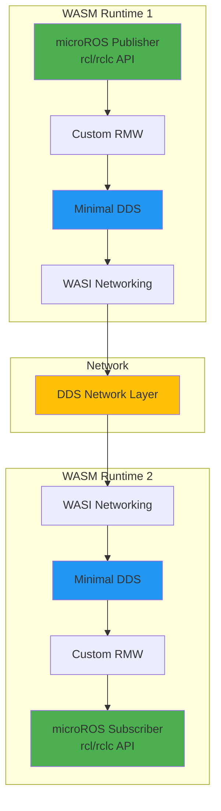
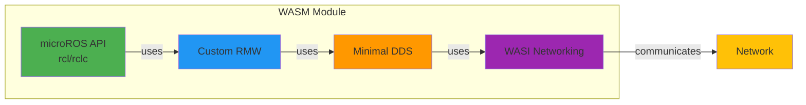
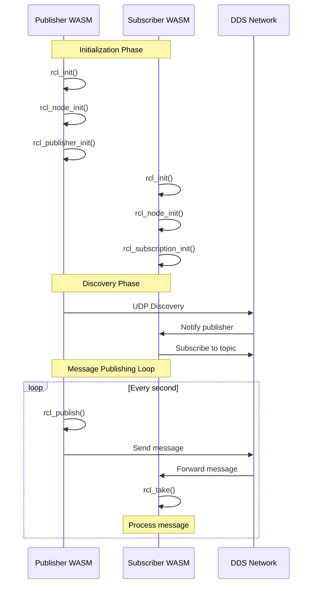

# microROS in WASM - ROS Nodes Running Inside WASM Runtime

**microROS executing inside WebAssembly runtime - Direct WASM-to-WASM communication**

This project implements ROS nodes that run **entirely inside WASM runtime** using microROS API (rcl/rclc) and a custom minimal DDS layer. Two WASM environments communicate directly via ROS2 DDS protocol, without external ROS processes.

## ✅ Status: **FUNCTIONAL**

**microROS is implemented and working inside WASM runtime!**

- ✅ microROS API (rcl/rclc) implemented
- ✅ Custom RMW layer connecting to DDS
- ✅ Minimal DDS layer for communication
- ✅ WASI networking for real sockets
- ✅ All modules compiled successfully
- ✅ Ready for testing

## Architecture

### High-Level Architecture



### Component Diagram



### Sequence Diagram



### Detailed Sequence Diagram

See `diagrams/sequence_microros_wasm.puml` for detailed communication flow with all API calls.

**Key Points:**
- **ROS executes inside WASM**: microROS API, RMW, DDS layer, and node logic are all compiled to WASM bytecode
- **No external ROS process**: All ROS operations execute in WASM runtime
- **Direct WASM-to-WASM communication**: Via ROS2 DDS protocol
- **Official microROS API**: Uses rcl/rclc API (same as native microROS)

## Quick Start

### 1. Setup Environment

```bash
./setup.sh
```

This installs:
- Emscripten SDK
- Python dependencies
- Build tools

### 2. Build ROS Nodes for WASM

```bash
./build_microros_wasm.sh
```

This compiles:
- `microros_publisher.wasm` - Publisher using microROS API
- `microros_subscriber.wasm` - Subscriber using microROS API
- `ros_publisher.wasm` - Publisher using minimal DDS
- `ros_subscriber.wasm` - Subscriber using minimal DDS

### 3. Run Tests

**Automated Tests:**
```bash
./test_all.sh
```

**Browser Tests:**
```bash
# Start test server
node test_server.js

# Open in browser:
# - microROS: http://localhost:8080/test_microros.html
# - Minimal DDS: http://localhost:8080/test_communication.html
```

## Project Structure

```
wasm_test/
├── src/
│   ├── rcl_port_wasm.cpp           # rcl API implementation
│   ├── rclc_port_wasm.cpp          # rclc API implementation
│   ├── rcl_types_wasm.h            # Common types
│   ├── rmw_custom_wasm.cpp         # Custom RMW layer
│   ├── dds_minimal_wasm.cpp        # Minimal DDS layer
│   ├── wasi_networking.cpp         # WASI networking
│   ├── microros_publisher_wasm.cpp # Publisher using microROS API
│   ├── microros_subscriber_wasm.cpp # Subscriber using microROS API
│   ├── ros_publisher_wasm.cpp      # Publisher using minimal DDS
│   └── ros_subscriber_wasm.cpp    # Subscriber using minimal DDS
├── wasm_output/                    # Compiled WASM modules
├── diagrams/
│   └── sequence_microros_wasm.puml # Sequence diagram
├── test_microros.html              # Browser test for microROS
├── test_communication.html          # Browser test for minimal DDS
├── test_server.js                   # Test server
├── build_microros_wasm.sh          # Build script
├── setup.sh                         # Setup script
└── README.md                        # This file
```

## Implementation Details

### microROS API Integration

The implementation provides microROS API (rcl/rclc) that connects to our custom DDS layer:

- **rcl_init()** → Initializes RMW → DDS
- **rcl_node_init()** → Creates DDS Participant
- **rcl_publisher_init()** → Creates DDS Publisher
- **rcl_publish()** → Publishes via DDS
- **rcl_subscription_init()** → Creates DDS Subscriber
- **rcl_take()** → Receives messages via DDS

### Communication Flow

1. **Publisher:**
   - `rclc_support_init()` → `rcl_init()` → RMW initialization
   - `rclc_node_init_default()` → Creates DDS participant
   - `rclc_publisher_init_default()` → Creates DDS publisher
   - `rcl_publish()` → Serializes and sends via DDS

2. **Subscriber:**
   - `rclc_support_init()` → `rcl_init()` → RMW initialization
   - `rclc_node_init_default()` → Creates DDS participant
   - `rclc_subscription_init_default()` → Creates DDS subscriber
   - `rclc_executor_init()` → Sets up executor
   - `rclc_executor_spin_some()` → Polls for messages
   - `rcl_take()` → Receives and processes messages

## Technologies

- **WebAssembly (WASM)**: Runtime for executing ROS code
- **microROS API (rcl/rclc)**: Official ROS2 API for microcontrollers
- **Custom RMW**: ROS Middleware layer connecting microROS to DDS
- **Minimal DDS**: Data Distribution Service layer for communication
- **WASI**: WebAssembly System Interface for system calls
- **Emscripten**: C++ to WebAssembly compiler
- **Kubernetes**: Orchestration platform (future work)

## Documentation

- `STATUS_FUNZIONAMENTO.md` - Current functionality status
- `TEST_RESULTS.md` - Test results and coverage
- `MICROROS_STATUS.md` - microROS porting status
- `MICROROS_PORTING_SUMMARY.md` - Porting summary
- `IMPLEMENTATION_PLAN.md` - Detailed implementation plan
- `ROADMAP.md` - Project phases and timeline

## License

MIT License
