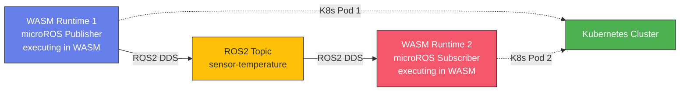
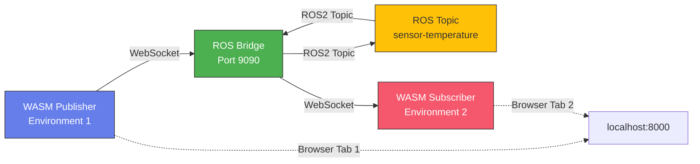
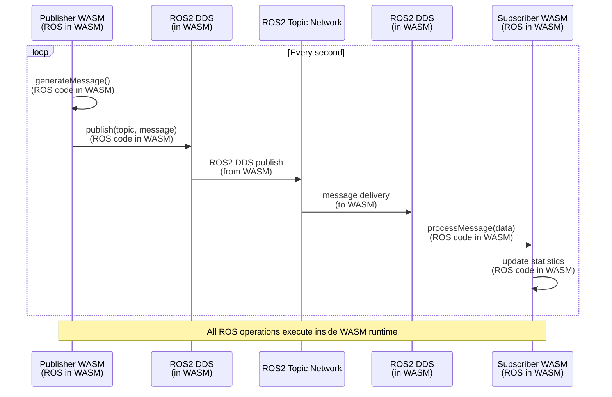
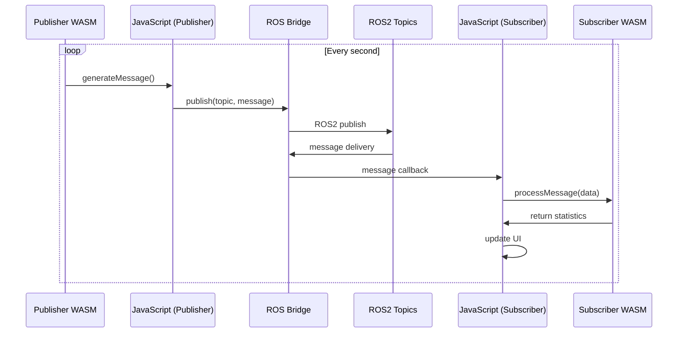
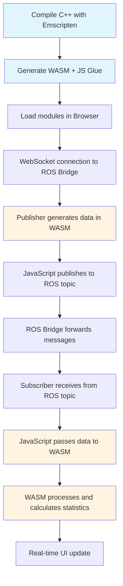
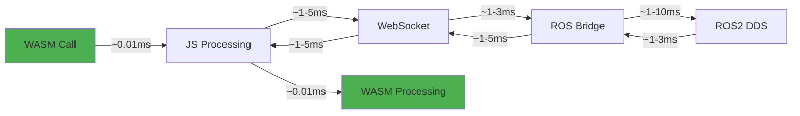

# microROS in WASM - Kubernetes Deployment

**ROS executing inside WebAssembly runtime on Kubernetes**

This project demonstrates microROS running inside WebAssembly (WASM) runtime, with ROS code compiled to WASM bytecode and executed by WASM runtime. Two independent WASM environments communicate directly via ROS2 DDS, without external ROS processes.

## Description

**Target Architecture**: microROS (ROS2) executes entirely inside WASM runtime:
- **Environment 1 (Publisher)**: microROS publisher node compiled to WASM, executing in WASM runtime
- **Environment 2 (Subscriber)**: microROS subscriber node compiled to WASM, executing in WASM runtime
- **Communication**: Direct WASM-to-WASM via ROS2 DDS (no external bridge)

**Current Implementation**: Prototype using ROS Bridge (for demonstration purposes)
- WASM modules communicate via JavaScript and ROS Bridge
- This serves as a proof-of-concept while microROS is being ported to WASM
- **⚠️ IMPORTANT**: ROS does NOT currently run inside WASM. See `IMPLEMENTATION_PLAN.md` and `ROADMAP.md` for the plan to achieve this.

## Target Architecture (microROS in WASM)



**Key Points:**
- **ROS executes inside WASM**: microROS core, ROS2 DDS layer, and node logic are all compiled to WASM bytecode
- **No external ROS process**: All ROS operations execute in WASM runtime
- **Direct WASM-to-WASM communication**: Via ROS2 DDS protocol
- **Kubernetes orchestration**: WASM runtimes deployed as K8s pods

### Current Prototype Architecture (ROS Bridge)



**Note**: The current prototype uses ROS Bridge for demonstration. The target architecture (microROS in WASM) is documented in the UML diagrams and PPTX presentation.

### Target Communication Flow (microROS in WASM)



### Current Prototype Flow (ROS Bridge)



## Prerequisites

### Option 1: Complete System (Recommended)

1. **Emscripten SDK** (to compile C++ to WASM)
```bash
git clone https://github.com/emscripten-core/emsdk.git
cd emsdk
./emsdk install latest
./emsdk activate latest
source ./emsdk_env.sh
```

2. **ROS2** (Humble or Foxy)
```bash
# Ubuntu/Debian
sudo apt update
sudo apt install ros-humble-desktop
sudo apt install ros-humble-rosbridge-suite
```

3. **Python 3** (for web server)
```bash
sudo apt install python3
```

### Option 2: Demo Only (without compilation)

If you just want to see the demo without recompiling WASM modules:
- ROS2 + rosbridge-suite
- Python 3
- Modern browser (Chrome, Firefox, Edge)

## Quick Start

### 1. Compile WASM modules

```bash
./build.sh
```

This compiles the C++ files in `src/` into WebAssembly modules in the `public/` directory.

### 2. Start the entire system

```bash
./start_all.sh
```

This script automatically starts:
- ROS Bridge (port 9090)
- Web Server (port 8000)

### 3. Open browsers

1. Open `http://localhost:8000/publisher.html` in one tab
2. Open `http://localhost:8000/subscriber.html` in another tab

### 4. Connect and communicate

**In Publisher:**
1. Click "Connect to ROS"
2. Click "Start Publishing"

**In Subscriber:**
1. Click "Connect to ROS"
2. Click "Subscribe to Topic"

You will now see data flowing from Publisher to Subscriber in real-time.

## Project Structure

```
wasm_test/
├── src/
│   ├── publisher_module.cpp    # WASM module for publisher (sensor)
│   └── subscriber_module.cpp  # WASM module for subscriber (actuator)
├── public/
│   ├── publisher.html          # Web interface for publisher
│   ├── subscriber.html         # Web interface for subscriber
│   ├── simple_publisher.html   # Simplified version (JS only)
│   ├── simple_subscriber.html  # Simplified version (JS only)
│   ├── publisher_module.js     # JS generated by Emscripten
│   ├── publisher_module.wasm   # Compiled WASM
│   ├── subscriber_module.js    # JS generated by Emscripten
│   └── subscriber_module.wasm  # Compiled WASM
├── build.sh                    # Build script
├── start_rosbridge.sh          # Start ROS Bridge
├── start_webserver.sh          # Start web server
├── start_all.sh                # Start everything
├── test_system.sh              # Automated test script
├── create_pptx.py             # PPTX presentation generator
├── microROS_WASM_K8s_Feasibility.pptx  # Feasibility presentation
├── Makefile                     # Make commands
├── Dockerfile                   # Docker container
├── docker-compose.yml           # Compose configuration
├── package.json                 # Node.js dependencies
├── requirements.txt             # Python/ROS dependencies
├── README.md                    # This guide
├── QUICKSTART.md                # Quick start guide
└── ARCHITECTURE.md              # Technical documentation
```

## System Testing

The project includes an automated test script to verify the configuration:

```bash
./test_system.sh
```

### Test Results

#### Functional Tests (WASM Modules)

| Test Category | Result | Details |
|--------------|--------|---------|
| File Verification | ✅ PASS | All WASM modules, HTML, and JS files present |
| WASM Module Validation | ✅ PASS | Publisher: 24 KB, Subscriber: 48 KB (valid format) |
| HTML Content Verification | ✅ PASS | All HTML files reference WASM correctly |
| JavaScript Module Check | ✅ PASS | All modules export correctly |
| Build Artifacts | ✅ PASS | Build scripts executable and configured |

**Functional Tests Summary**: 18/18 tests passed ✅

#### System Tests (Dependencies)

| Test | Result | Notes |
|------|--------|-------|
| Emscripten installed | ❌ FAIL | Requires installation (see Prerequisites) |
| ROS2 installed | ❌ FAIL | Requires installation (see Prerequisites) |
| Python3 installed | ✅ PASS | Version available |
| File publisher_module.cpp exists | ✅ PASS | 1.5 KB |
| File subscriber_module.cpp exists | ✅ PASS | 2.5 KB |
| File publisher.html exists | ✅ PASS | 11 KB |
| File subscriber.html exists | ✅ PASS | 12 KB |
| build.sh is executable | ✅ PASS | Correct permissions |
| start_rosbridge.sh is executable | ✅ PASS | Correct permissions |
| start_webserver.sh is executable | ✅ PASS | Correct permissions |
| Port 8000 available | ✅ PASS | No conflicts |
| Port 9090 available | ✅ PASS | No conflicts |

**System Tests Summary**: 10/12 tests passed (2 failures are expected - external dependencies)

**Note**: 
- All project files and scripts are present and correctly configured
- Failed tests (Emscripten, ROS2) are external dependencies that must be installed
- Current implementation uses ROS Bridge (prototype)
- Target architecture: microROS compiled to WASM (see UML diagrams and PPTX)

### Manual Communication Testing

You can verify that WASM modules are communicating correctly through ROS:

```bash
# Separate terminal
source /opt/ros/humble/setup.bash

# List active topics
ros2 topic list

# Show published messages
ros2 topic echo /sensor/temperature

# Show topic info
ros2 topic info /sensor/temperature

# Monitor publication frequency
ros2 topic hz /sensor/temperature

# Monitor latency
ros2 topic delay /sensor/temperature
```

## Manual Startup

If you prefer to start components individually:

### Terminal 1: ROS Bridge
```bash
./start_rosbridge.sh
```

### Terminal 2: Web Server
```bash
./start_webserver.sh
```

### Terminal 3: ROS Monitor (optional)
```bash
source /opt/ros/humble/setup.bash
ros2 topic echo /sensor/temperature
```

## Features

### Publisher (WASM Environment 1)

- Simulated temperature sensor data generation
- Publication to ROS topic `/sensor/temperature`
- Real-time visualization of:
  - Number of published messages
  - Current temperature value
  - Publication frequency
- Detailed console log
- Start/stop/reset controls

### Subscriber (WASM Environment 2)

- Data reception from ROS topic
- Message processing in WASM
- Average value calculation
- Automatic alarm system (temp > 25°C)
- Visual temperature indicator
- Detailed console log
- Value history management (last 10)

## Troubleshooting

### Error: "Failed to connect to ROS Bridge"
- Verify rosbridge_server is running: `./start_rosbridge.sh`
- Check that port 9090 is free: `lsof -i :9090`
- Verify ROS2 is configured: `source /opt/ros/humble/setup.bash`

### Error: "emcc: command not found"
- Activate Emscripten: `source /path/to/emsdk/emsdk_env.sh`
- Verify installation: `emcc --version`
- Consult Prerequisites section for complete installation

### WASM modules not loading
- Check browser console (F12)
- Verify web server is running on port 8000
- Ensure .wasm files are in `public/`
- Verify modules were compiled: `ls -lh public/*.wasm`

### ROS2 not found
- Verify installation: `ros2 --version`
- Source workspace: `source /opt/ros/humble/setup.bash`
- Install rosbridge-suite: `sudo apt install ros-humble-rosbridge-suite`

### Port already in use
```bash
# Find process on port
lsof -i :9090
lsof -i :8000

# Terminate process if needed
kill -9 <PID>
```

## How It Works



1. **Compilation**: C++ files are compiled to WebAssembly using Emscripten with `embind` option to expose C++ classes to JavaScript.

2. **Loading**: HTML pages load WASM modules as ES6 JavaScript modules.

3. **Connection**: Both pages connect to ROS Bridge via WebSocket (port 9090).

4. **Communication**: 
   - Publisher creates a `PublisherNode` object in WASM that generates data
   - JavaScript publishes this data to ROS topic via roslib.js
   - ROS Bridge forwards messages through ROS system
   - Subscriber receives messages from topic
   - JavaScript passes data to `SubscriberNode` object in WASM for processing

5. **Processing**: Business logic (sensor generation, actuator control) is entirely in WASM for maximum performance.

## Technologies Used

### Target Architecture (microROS in WASM)
- **WebAssembly (WASM)**: Runtime for executing ROS code
- **microROS**: ROS2 for resource-constrained devices (compiled to WASM)
- **ROS2 DDS**: Data Distribution Service layer (compiled to WASM)
- **WASI**: WebAssembly System Interface for system calls
- **Kubernetes**: Orchestration platform for WASM runtimes
- **Wasmtime/Wasmer**: WASM runtime engines

### Current Prototype
- **WebAssembly (WASM)**: High-performance runtime in browser
- **Emscripten**: C/C++ → WebAssembly compiler
- **ROS2**: Robot/distributed systems communication system
- **rosbridge_suite**: WebSocket bridge for ROS (prototype only)
- **roslib.js**: JavaScript library for ROS (prototype only)
- **C++**: Language for WASM modules
- **HTML5 + JavaScript ES6**: Modern web interfaces
- **Mermaid**: Architecture diagrams
- **PlantUML**: Formal UML diagrams

## Performance

### Latency Metrics (estimated)



- **Total latency**: ~5-30ms (local network)
- **Throughput**: ~1 message/second (configurable)
- **WASM size**: ~50-100 KB per module
- **Memory**: ~10-20 MB per module

### Optimizations

- Compilation with `-O3` for maximum performance
- Dynamic memory growth to handle variable data
- Efficient binding via embind
- Optimized JSON serialization

## Possible Extensions

- [ ] Add more sensors/actuators
- [ ] Implement bidirectional communication
- [ ] Add real-time chart visualization
- [ ] Support more ROS message types
- [ ] Implement ROS services in addition to topics
- [ ] Add authentication for rosbridge
- [ ] Deploy on remote server with HTTPS/WSS
- [ ] Support for binary messages (Protocol Buffers)
- [ ] Integration with RViz for 3D visualization

## Architecture Documentation

### UML Diagrams (PlantUML)

Formal UML diagrams showing the target architecture (microROS in WASM):

- `diagrams/architecture_complete.puml` - Complete system architecture
- `diagrams/architecture.puml` - Basic architecture diagram
- `diagrams/sequence.puml` - Communication sequence diagram
- `diagrams/k8s_deployment.puml` - Kubernetes deployment architecture
- `diagrams/component_diagram.puml` - System component diagram
- `diagrams/workflow.puml` - Complete workflow diagram

All diagrams emphasize: **ROS executes inside WASM runtime** (compiled to WASM bytecode, executed by WASM runtime, no external ROS process).

### Presentation

- `microROS_WASM_K8s_Feasibility.pptx` - Complete feasibility presentation with UML diagrams

## Notes

### Target Architecture (microROS in WASM)
- **ROS executes inside WASM**: All ROS code (microROS core, ROS2 DDS, node logic) is compiled to WASM bytecode
- **No external ROS process**: Everything runs in WASM runtime
- **Direct WASM-to-WASM communication**: Via ROS2 DDS protocol
- **Kubernetes orchestration**: WASM runtimes deployed as K8s pods
- **Full isolation**: WASM sandbox provides security and portability

### Current Prototype (ROS Bridge)
- WASM modules communicate via JavaScript and ROS Bridge
- This serves as a proof-of-concept while microROS is being ported to WASM
- Each module can run on different machines by changing rosbridge URL
- System is scalable: you can add N WASM environments that communicate
- Latency depends on network and rosbridge configuration
- Automated tests verify configuration but don't require ROS/Emscripten to function

## License

MIT License - Free for personal and commercial use

## Author

Created as an educational example of WASM-ROS communication

---

For a quick guide, see `QUICKSTART.md`.  
For detailed technical information, see `ARCHITECTURE.md`.
